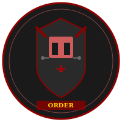

# Hellknights

## Overview
- **Type:** Paramilitary law enforcement organizations
- **Alignment:** Lawful Neutral (officially, though individual orders vary)
- **Primary Region:** [[Locations/Cheliax|Cheliax]], with orders throughout the Inner Sea region
- **Primary Deity:** [[Deities/Asmodeus|Asmodeus]] (common but not required)
- **Philosophy:** Order through absolute discipline and law
- **Structure:** Multiple independent orders, each with its own focus
- **Symbol:** Varies by order

## Description
The Hellknights are armored paramilitary organizations dedicated to maintaining order and enforcing law through absolute discipline and unwavering adherence to their codes. Despite their infernal-sounding name and origins in [[Locations/Cheliax|Cheliax]], Hellknights are not inherently evil—they are fanatics of order who believe that law and discipline are the only bulwarks against chaos.

Each Hellknight order operates semi-independently with its own focus, territory, and interpretation of what "order" means. What unites them is their brutal efficiency, distinctive armor, and willingness to use harsh methods to achieve their goals.

## Philosophy and Beliefs

### Core Tenets
**Order Above All:**
- Law must be enforced without exception or mercy
- Chaos is the greatest threat to civilization
- Personal feelings are irrelevant to justice
- The ends of order justify harsh means

**Discipline and Strength:**
- Weakness invites chaos
- Perfect discipline creates perfect order
- Individual desires must submit to collective law
- Strength through rigorous training and testing

**The Test:**
- All Hellknights must pass a brutal test to join
- The test breaks the weak and purifies the strong
- Only those who survive prove worthy of the order
- Pain and suffering forge true discipline

### Relationship with Asmodeus
While many Hellknights worship [[Deities/Asmodeus|Asmodeus]], it's not a requirement:
- Asmodeus represents perfect law and order
- His philosophy aligns with Hellknight ideals
- The church of Asmodeus supports many orders
- However, Hellknights serve law first, gods second
- Some orders include worshippers of other lawful deities
- The order itself supersedes religious affiliation

## Major Hellknight Orders

### Order of the Nail
- **Focus:** Exterminating monsters and threats to civilization
- **Territory:** Various frontier regions
- **Philosophy:** Civilization must be defended from the wild
- **Methods:** Brutal but effective monster-hunting

### Order of the Scourge
- **Focus:** Rooting out corruption and enforcing moral purity
- **Territory:** [[Locations/Cheliax|Cheliax]] primarily
- **Philosophy:** Internal rot destroys order from within
- **Methods:** Inquisitorial investigations and purges

### Order of the Rack
- **Focus:** Interrogation, investigation, and extracting truth
- **Territory:** Various urban centers
- **Philosophy:** Truth serves order
- **Methods:** Systematic torture and questioning

### Order of the Pike
- **Focus:** Military discipline and warfare
- **Territory:** Border regions
- **Philosophy:** Order through military strength
- **Methods:** Traditional military operations

### Order of the Gate
- **Focus:** Containing extraplanar threats
- **Territory:** Sites of planar incursion
- **Philosophy:** The planes must be kept separate
- **Methods:** Banishment and containment rituals

### Other Orders
Many other orders exist with various specializations, from urban peacekeeping to maritime law enforcement. Each maintains its own traditions and methods while adhering to Hellknight principles.

## Structure and Organization

### Hierarchy
**Lictor:** Commander of an order
**Paralictors:** Senior officers and advisors
**Maralictor:** Master of the order's citadel
**Paralictor:** Field commanders
**Signifiers:** Magic-users and ritualists
**Armigers:** Knights in training
**Full Knights:** Standard members who passed the test

### The Test
To become a full Hellknight, an armiger must pass "the Test":
- A brutal ordeal designed to break the weak
- Combines physical torture, mental strain, and moral testing
- Many die or are permanently broken
- Those who pass emerge fanatically devoted
- The exact nature varies by order
- Survivors consider themselves purified and reborn

### Training
Hellknight training is notoriously harsh:
- Absolute obedience to superiors
- Rigorous physical conditioning
- Mental discipline and indoctrination
- Combat techniques emphasizing overwhelming force
- Study of law and order philosophy
- Suppression of individual identity

## Equipment and Tactics

### Hellknight Plate
Distinctive full plate armor marking their order:
- Heavy, intimidating design
- Order-specific styling and symbols
- Often spiked or horned
- Face-concealing helmets
- Enchanted in higher ranks
- Designed to inspire fear and respect

### Combat Methods
- Overwhelming force and intimidation
- Disciplined formations
- No quarter given to chaos and disorder
- Willingness to accept casualties to achieve objectives
- Combined arms with signifiers providing magical support
- Brutal efficiency over mercy

## Hellknights in the Inner Sea Region

### In Cheliax
- Most orders headquartered in [[Locations/Cheliax|Cheliax]]
- Strong ties to the diabolic government
- Enforce Chelish law with iron fists
- Respected and feared in equal measure
- Political power through military strength

### In Isger
- Present during the [[Events/Goblinblood Wars|Goblinblood Wars]] as observers
- Some operations in post-war reconstruction
- Training grounds and recruitment
- [[Locations/Isger|Isger]]'s weakness makes them influential
- Connected to institutions like [[Locations/Monastery of the Golden Erinyes|the Monastery]]

### In Other Nations
- Officially operate as independent law enforcers
- Some nations welcome them, others resist
- Legal status varies by region
- Often hired for specific operations
- Controversial but effective

## Relationship with Other Organizations

### The Church of Asmodeus
- Strong philosophical alignment
- Many Hellknights are Asmodean
- Church provides resources and support
- Mutual respect for order and hierarchy
- However, Hellknights maintain independence

### The Sisters of the Golden Erinyes
[[Organizations/Sisters of the Golden Erinyes|The Sisters]] maintain connections to Hellknight orders:
- Some orders appreciate their disciplinary methods
- Graduates sometimes join Hellknight training
- Philosophical alignment on breaking rebelliousness
- Hellknights provide protection and legitimacy
- The monastery produces potential armigers

### Government Relations
- Some nations employ them as peacekeepers
- Others ban them as foreign military
- Cheliax uses them as internal police
- Independent city-states sometimes hire specific orders
- Always controversial, rarely neutral

## Public Perception

### Those Who Support Them
- Merchants who want trade routes protected
- Nobles who value order over freedom
- Those who've been saved from genuine threats
- Cities plagued by chaos or crime
- Asmodean faithful who see them as righteous

### Those Who Fear/Hate Them
- Anyone who values freedom over order
- Those who've suffered under harsh "justice"
- Chaos-aligned individuals and organizations
- Free-spirited adventurers and rebels
- Communities that value mercy and compassion

### The Reality
Hellknights are neither purely good nor evil:
- They genuinely stop monsters and bandits
- They also brutalize innocents in the name of order
- Their law is blind to compassion
- They create order but destroy freedom
- Effectiveness comes at a terrible cost
- They are weapons—their morality depends on who wields them

## Relevance to the Campaign

### Connection to Rust's Past
- Hellknights likely involved in post-[[Events/Goblinblood Wars|Goblinblood Wars]] operations
- May have been the force that destroyed Rust's original tribe
- Connected to [[Locations/Monastery of the Golden Erinyes|the monastery]] through training and philosophy
- Guards at the monastery are Hellknight-trained
- [[NPCs/Sister Velenne|Sister Velenne]] has Hellknight connections

### Potential Campaign Hooks
- Former monastery children who became Hellknights
- Hellknights hunting Rust for escaping "lawful custody"
- Orders that would view his oracle powers as chaos to be controlled
- Philosophical conflicts about order vs. freedom
- Hellknights as antagonists who believe they're righteous
- Possible allies if interests align (monster hunting, etc.)

### Thematic Significance
Hellknights represent what Rust could have become:
- Broken by discipline and rebuilt as a weapon
- Individual identity erased in service to order
- Survival through absolute obedience
- The "success story" of the monastery's methods

They also represent a mirror to [[Deities/Asmodeus|Asmodeus]]'s philosophy:
- Order without mercy
- Law without compassion
- Strength through breaking
- The cost of absolute control

## Philosophical Questions

### For the Party
- Is brutal order better than chaotic freedom?
- Can harsh methods be justified by good results?
- Where is the line between law enforcement and tyranny?
- Are Hellknights victims of their own indoctrination?
- Can someone broken by the Test ever truly be free?

### For Rust Specifically
- Would the monastery have sent him to Hellknight training?
- Could he have survived their Test?
- Would he have become one of them if he'd stayed?
- How does he feel about "successful" monastery graduates?
- Are they enemies, victims, or both?

## Notable Hellknight Characteristics

### In Combat
- Utterly fearless (fanaticism or broken fear response)
- Never retreat without orders
- Willing to die for the mission
- Terrifying to face in formation
- Merciless to enemies of order

### In Society
- Respect strength and discipline
- Despise weakness and chaos
- Follow orders without question
- Often emotionally distant or broken
- View suffering as purifying

### Psychological Impact
Many Hellknights bear signs of their Test:
- Emotional numbness
- Absolute devotion to order
- Difficulty with personal relationships
- Trauma masked as discipline
- Identity subsumed into the order

## Symbols and Iconography
- Order-specific armor designs
- Heraldry incorporating infernal imagery
- Fortified citadels and strongholds
- Banners displaying order symbols
- Distinctive rank insignia

---

*"We are order made manifest. We are law without compromise. We are the wall against chaos, and we do not break."* - Hellknight oath
